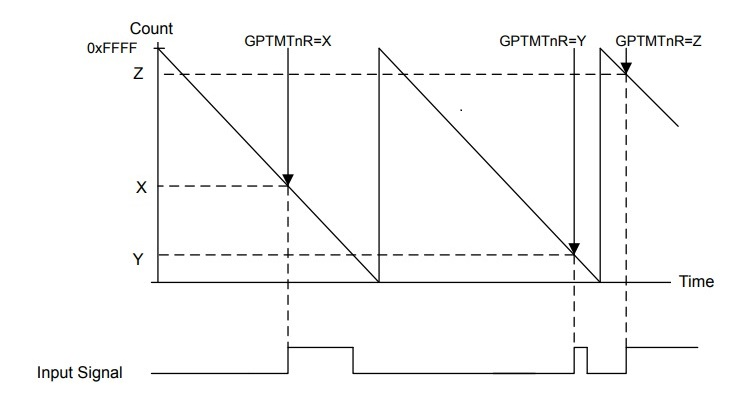
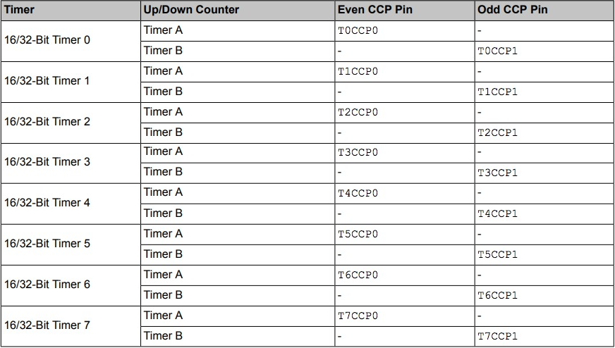

# Useful functions and parameters to be used

## Timer configuration to detect rising and falling edge (_Input Edge-Time Mode_)

### Syntax and configuration 
> TivaWare Peripheral Driver Library, section 29.2.2.6. [[1]](http://dainf.ct.utfpr.edu.br/~hvieir/EL68E/SW-TM4C-DRL-UG-2.1.4.178.pdf)

```c
void TimerControlEvent(uint32_t ui32Base, uint32_t ui32Timer, uint32_t ui32Event);
```

- **ui32Base** is the base address of the timer module.
- **ui32Timer** specifies the timer(s) to be adjusted; must be one of **TIMER_A**, **TIMER_B**, or
**TIMER_BOTH**.
- **ui32Event** specifies the type of event; must be one of **TIMER_EVENT_POS_EDGE**,
**TIMER_EVENT_NEG_EDGE**, or **TIMER_EVENT_BOTH_EDGES**.



### Possible ports to be used
> CCP pins can be found in the table 13-1 - Available CCP Pins, page 956 [[2]](http://www.ti.com/lit/ds/symlink/tm4c1294ncpdt.pdf)



### Justification

> TM4C1294NCPDT Datasheet, section 13.4.4. [[2]](http://www.ti.com/lit/ds/symlink/tm4c1294ncpdt.pdf)

The operation mode that we are going to use for GPTM is the Input Edge-Count Mode, because it can be configurable to count time between two external events, being rising edge, falling edge or both. In this mode, ”timer is configures as a 24-bit up- or down-counter including the optional prescaler with the upper timer value stored int he GPTMnPR register and the lower bits in the PGTMTnILR register.

<br/>

## Timer configuration to interrupt after a given amount of time

### Syntax and configuration 
> TivaWare Peripheral Driver Library, section 28.2.2.8. [[1]](http://dainf.ct.utfpr.edu.br/~hvieir/EL68E/SW-TM4C-DRL-UG-2.1.4.178.pdf)

```c
void SysTickPeriodSet(uint32_t ui32Period);
```

- **ui32Period** is the number of clock ticks in each period of the SysTick counter and must be
between 1 and 16, 777, 216, inclusive.

> **Note:**
> Calling this function does not cause the SysTick counter to reload immediately. If an immediate
reload is required, the NVIC_ST_CURRENT register must be written. Any write to this register
clears the SysTick counter to 0 and causes a reload with the ui32Period supplied here on the
next clock after SysTick is enabled.

### Justification

# Other tools

### Registers

- GPTM Configuration
- GPTM Timer Mode
- GPTM Control
- GPTM Timer n Prescale Register
- GPTM Timer n Interval Load
- GPTM Interrupt Mask
- GPTM Control
- GPTM Interrupt Clear
- GPTM Timer n

### APIs

The main API that we are going to use is the TimerAPI, because 
”The timer API provides a set of functions for using the timer module. Functions are provided to configure and control the timer, modify timer/counter values, and manage timer interrupt handling.”

We are also going to use the SysTic API, because it provides a periodic interrupt and it is simple to use for timing purposes.

## References

[1] [TivaWare Peripheral Driver Library](http://dainf.ct.utfpr.edu.br/~hvieir/EL68E/SW-TM4C-DRL-UG-2.1.4.178.pdf)<br/>
[2] [TM4C1294NCPDT Datasheet](http://www.ti.com/lit/ds/symlink/tm4c1294ncpdt.pdf)